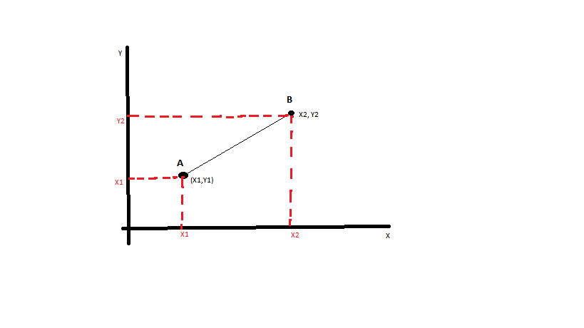

```{r setup, include = FALSE}
knitr::opts_chunk$set(warning = FALSE, message = FALSE, comment = NA)
reticulate::use_condaenv("wagathuenv")
source("RF.R")
```
# K -Nearest Neighbor Prediction

The linear regression makes huge assumptions about the structure of data
and yields stable but possibly inaccurate predictions. On the other
hand, the method of **K - Nearest Neighbor** makes very mild structural
assumptions and yields to accurate but unstable \^[Stable predictions
means that when the data is changed a little, the predictions change a
little. With the linear model all of the data contributes to the
predictions for any particular x. This gives low variance, hence its
predictions can be **stable** --- but high bias if the linear model is
not a good approximation. With the k-nearest neighbors method, for any
particular x only the k-nearest neighbors contribute to the prediction.
As a result the variance is higher, hence its predictions can be
**unstable** --- this is especially so if kk is much smaller than n. The
gain is that by only using close points, the approximation could be
better, so potentially lower bias.] predictions.

The parameter K in KNN refers to the number of labelled points
(neighbors) considered for classification. The value of k indicates the
number of pairs used to determine the result.

Given a data point whose class we don't know, we can try to understand
which points in our feature space are closest to it. These pairs are
known as the k-nearest neighbors. It is very likely that the point
belong to the same class as its neighbors. It is usually known as lazy
learner algorithm because it only stores a training data set versus
undergoing a training stage. It means that computations only occur when
classification or prediction is being made. The algorithm is as follows;

step 1: Select the number of k-neighbors;

step 2: Calculate the **Euclidean distance** (p = 2) between the point
and the k - nearest neighbors.



The Euclidean distance between point A and point B is calculated as;

$$distance  = \sqrt{(x_2-x_1)^2 + (y_2 - y_1)^@}$$

More Generally;

$$d(x_i, y_i) = \sqrt{\sum(y_i - x_i)}$$

This is basically the distance between the query point and the other
data points. We the nearest neighbors to determine the group of the data
point. Suppose another unclassified data point Y is placed between group
A and group B. If K is equal to 10, we pick the group that gets the most
votes, meaning that we classify Y to the group in which it has the most
number of neighbors. For example, if Y has seven neighbors in group B
and three neighbors in group A, it belongs to group B.

Consider an example where we have data from the questionnaire survey
asking people's opinion about a tissue paper based on two attributes;
acid durability and strength. The people classify the tissue paper as
good or bad. Here is four training samples

+-------------------+-----------+------------------------+
| **X1**            | x2        | **Y**                  |
|                   |           |                        |
| **(Acid           | (         | **(Classification)**   |
| Durability)**     | Strength) |                        |
+===================+===========+========================+
| 7                 | 7         | Bad                    |
+-------------------+-----------+------------------------+
| 7                 | 4         | Bad                    |
+-------------------+-----------+------------------------+
| 3                 | 4         | Good                   |
+-------------------+-----------+------------------------+
| 1                 | 4         | Good                   |
+-------------------+-----------+------------------------+

Now the factory produces a new paper tissue that pass laboratory test
with x1 = 3 and x2 = 7./ Without, an expensive survey, can we guess the
classification of the new tissue? We first select the parameter $K$.
Suppose that $K = 3$. The next step is to calculate the Euclidean
distance between the query instance and all the training samples as
follows;

+------------------+--------------+------------------------+
| X1               | x2           | Distance               |
|                  |              |                        |
| (Acid            | (Strength)   |                        |
| Durability)      |              |                        |
+==================+==============+========================+
| 7                | 7            | $(7-3)^                |
|                  |              | 2 + (7-7)^2=\sqrt{16}$ |
+------------------+--------------+------------------------+
| 7                | 4            | $(7-3)^2               |
|                  |              | + (4-7)^2 = \sqrt{25}$ |
+------------------+--------------+------------------------+
| 3                | 4            | $(3-3)^2               |
|                  |              |  + (4-7)^2 = \sqrt{9}$ |
+------------------+--------------+------------------------+
| 1                | 4            | $(1-3)^@               |
|                  |              | + (4-7)^2 = \sqrt{13}$ |
+------------------+--------------+------------------------+

The next step is to sort the distance to determine the nearest neighbor

+----------------+-------------+------------------+--------+---------------+
| X1             | x2          | Distance         | Rank   | Neighbors?    |
|                |             |                  |        |               |
| (Acid          | (Strength)  |                  |        |               |
| Durability)    |             |                  |        |               |
+================+=============+==================+========+===============+
| 7              | 7           | $(7-3)^2 + (7    | 3      | Yes           |
|                |             | -7)^2=\sqrt{16}$ |        |               |
+----------------+-------------+------------------+--------+---------------+
| 7              | 4           | $(7-3)^2 + (4-7  | 4      | No            |
|                |             | )^2 = \sqrt{25}$ |        |               |
+----------------+-------------+------------------+--------+---------------+
| 3              | 4           | $(3-3)^2 + (4-   | 1      | Yes           |
|                |             | 7)^2 = \sqrt{9}$ |        |               |
+----------------+-------------+------------------+--------+---------------+
| 1              | 4           | $(1-3)^@ + (4-7  | 2      | Yes           |
|                |             | )^2 = \sqrt{13}$ |        |               |
+----------------+-------------+------------------+--------+---------------+

The next step is to gather the category of the nearest neighbors;

+----------------+------------+---------+--------+-------------------+--------------+
| X1             | x2         | D       | Rank   | Neighbors?        | Y            |
|                |            | istance |        |                   |              |
| (Acid          | (Strength) |         |        |                   | (Category)   |
| Durability)    |            |         |        |                   |              |
+================+============+=========+========+===================+==============+
| 7              | 7          | 4       | 3      | Yes               | Bad          |
+----------------+------------+---------+--------+-------------------+--------------+
| 7              | 4          | 5       | 4      | No                | \-           |
+----------------+------------+---------+--------+-------------------+--------------+
| 3              | 4          | 3       | 1      | Yes               | Good         |
+----------------+------------+---------+--------+-------------------+--------------+
| 1              | 4          | 3.60    | 2      | Yes               | Good         |
+----------------+------------+---------+--------+-------------------+--------------+

Using the simple majority of the category of the nearest neighbor as the
prediction value of the query instance, we have 2 good and 1 bad, and
since 2\>1, then we conclude that the new paper tissue that has the
laboratory pass of x1= 3 and x2 = 7 is included in the good category.

Suppose that we wish to determine whether a person has diabetes given some factors. We can do the knn in R as follows;

```{r}
#Choosing 
set.seed(123)
split_s <- .8
split_size3 <- floor(split_s * nrow(pima))
indicies3 <- sample(seq_len(nrow(pima)), size = split_size3)

#Removing the Outcome variable since it is our target
pima.subset <- pima[,1:8]

trainpima <- pima.subset[indicies3,]
testpima <- pima.subset[-indicies3,]
testpima <- testpima[, -9]

```

After creating the training and testing data sets, we now create a new data set for the target variable *outcome* as follows;


```{r}
set.seed(123)
train.pima_labels <- pima[indicies3,9]
test.pima_labels <- pima[-indicies3, 9]
```

We then find the number of observations so that we can be able to calculate the parameter k as the square root of the total number of observations in the train data set of the outcome variable as follows;

```{r}
NROW(train.pima_labels)
```

The square root of 601 is 24.5, thus the parameter k will be either 24 or 25 which implies that we shall have two models done as follows;

```{r}
library(class)
set.seed(123)
knn.24 <- knn(train = trainpima, test = testpima, cl = train.pima_labels, k = 24)
```

After building the model its time to calculate the model accuracy, by calculating the confusion matrix from the infamous Caret package as follows;

```{r}
library(caret)
set.seed(123)
confusionMatrix(table(knn.24, test.pima_labels))

```

For the k = 25 model;

```{r}
set.seed(123)
library(caret);library(class)
knn.25 <- knn(train = trainpima, test = testpima, cl = train.pima_labels, k = 25)

confusionMatrix(table(knn.25, test.pima_labels))
```

The best model is the one with the parameter k as 24, and it's accuracy is 72.85% which a good accuracy

We can also write a function to look up for the value of K which yields to the highest accuracy as follows;

```{r}
set.seed(123)
knnParameter <- function()
{
  library(class)
  set.seed(123)
  vector <- as.vector(1:28)
  i = 1
  knn.accuracy = 1
  for (i in vector ) 
    {
      knn.mod <- knn(train = trainpima, test = testpima, cl = train.pima_labels, k = i)
      knn.accuracy[i] <- 100 * sum(test.pima_labels == knn.mod)/NROW(test.pima_labels)
      k = i
      cat(k,'=',knn.accuracy[i],'
')
  }
}

knnParameter()
```

Thus the parameter K that yields the highest accuracy is $k = 23$, which can also be seen from the graph below

```{r}
knnParameter <- function()
{
  library(class)
  set.seed(123)
  vector <- as.vector(1:28)
  i = 1
  knn.accuracy = 1
  for (i in 1:28 ) 
    {
      knn.mod <- knn(train = trainpima, test = testpima, cl = train.pima_labels, k = i)
      knn.accuracy[i] <- 100 * sum(test.pima_labels==knn.mod)/NROW(test.pima_labels)
  }
  plot(knn.accuracy, type="b", xlab="K- Value",ylab="Accuracy level")
}

knnParameter()
```

Thus the best model is written as follows;

```{r}
library(class)
set.seed(123)
knn.23 <- knn(train = trainpima, test = testpima, cl = train.pima_labels, k = 23)
```

The confusion matrix is;

```{r}
set.seed(123)
confusionMatrix(table(knn.23, test.pima_labels))
```

Thus the accuracy is 72.19%.


